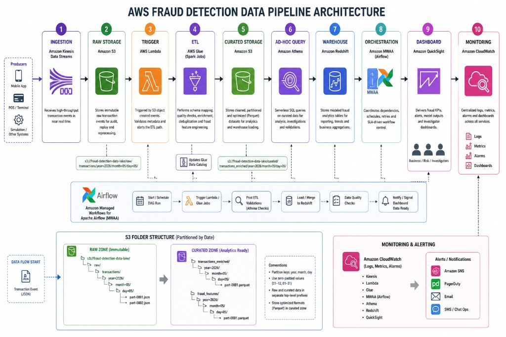

# AWS Fraud Detection Pipeline — Architecture

This document describes reference layers for a fraud-detection analytics pipeline on AWS: which services fulfill each responsibility, how data moves between them, and how curated storage is laid out on S3 for queries and warehousing.

## Architecture Diagram



This diagram shows the end-to-end platform flow from ingestion through monitoring, including orchestration, storage zones, and downstream analytics consumption.

---

## Ingestion (Kinesis)

| | |
|--|--|
| **AWS service** | Amazon **Kinesis Data Streams** (or **Kinesis Data Firehose** for delivery with optional transformation and compression). Streams are typical when producers need low-latency fan-out or custom consumers such as Lambda. |
| **What it does** | Accepts **high-volume, ordered transaction or event records** from the producer (`src/producer/producer.py` or transactional systems via SDK/KPL). Streams buffer durably until consumers read or Firehose persists to downstream targets. Partition keys (for example user or merchant IDs) distribute load across shards. |
| **Connection to next layer** | Consumers such as AWS Lambda subscribed to the stream (or Firehose destinations) receive batches of records and **write raw payloads into the raw S3 landing zone**. Alternatively, Lambda can enqueue work or normalize keys before PUT; Firehose writes directly to S3 with buffering and prefix configuration. Raw storage is thus fed **near real-time** from Kinesis-driven paths. |

---

## Raw Storage (S3)

| | |
|--|--|
| **AWS service** | Amazon **S3**. |
| **What it does** | Stores **immutable raw events** exactly as landed (often JSON or Parquet if pre-serialized): full fidelity for replay, Glue crawlers/ETL, and compliance/audit trails. Typical prefix layout uses **hive-style partitioning** (`year=` / `month=` / `day=`) plus optional hour or ingestion batch IDs. Lifecycle rules can tier cold raw data or expire after curated copies are validated. Server-side encryption (SSE-S3/KMS) and bucket policies constrain access (Glue IAM roles, Redshift IAM roles). |
| **Connection to next layer** | **S3 `ObjectCreated`** events (PUT/CompleteMultipartUpload) invoke the **Lambda trigger** configured on the bucket or prefix filtered to landing paths. Glue jobs can also run on schedules from **MWAA**. Thus raw S3 sits between ingestion output and downstream processing initiation. |

---

## Trigger (Lambda)

| | |
|--|--|
| **AWS service** | AWS **Lambda**. |
| **What it does** | Implements **thin orchestration** on events—for example **`src/lambda/trigger.py`**: validate object keys, normalize metadata (transaction type, ingestion batch ID), optionally **invoke `StartJobRun` on AWS Glue**, send messages to SNS/SQS for alerting, or call Step Functions when multi-step branching is needed. Keeps ingestion simple and avoids long-running transforms in Lambda. |
| **Connection to next layer** | On success, Lambda **starts a Glue job** (REST API or boto3 `glue.StartJobRun`) whose script reads from raw S3 and writes curated outputs—or signals Airflow MWAA paths that depend on Glue. The **Glue ETL layer** is the principal consumer initiated from these triggers alongside scheduled DAGs. |

---

## ETL (Glue)

| | |
|--|--|
| **AWS service** | AWS **Glue** — **Glue Data Catalog**, **Glue ETL Jobs** (`src/glue/fraud_etl.py`) or Spark jobs, optionally **Glue Crawlers** for schema discovery over curated prefixes. |
| **What it does** | Executes **validated, partitioned transforms**: deduplication by event ID, enrichment (merchant risk scores, geography), feature engineering tables (rolling aggregates, velocity), PII hashing where required, output as **Apache Parquet** with stable schemas. Glue job bookmarks minimize reprocessing unless full reload is intentional. IAM role grants least privilege to raw and curated prefixes and Glue Catalog APIs. |
| **Connection to next layer** | Writes **processed datasets** to distinct **curated S3 prefixes** (`curated/transactions/` etc.). Glue Catalog tables and partitions registered after each job steer **Athena** ad-hoc SQL and **Amazon Redshift Spectrum** external scans toward identical S3 prefixes, so Glue forms the handshake between immutable lake files and reusable analytics schemas. |

---

## Curated Storage (S3)

| | |
|--|--|
| **AWS service** | Amazon **S3** (separate prefix tree or bucket from raw for blast-radius and IAM clarity). |
| **What it does** | Holds **clean, schema-stable Parquet/ORC** partitioned for analytics (`year=` / `month=` / `day=`). Optionally exposes **staging** prefixes for Glue job temp output or manifest files awaiting promotion checks. Lifecycle and versioning policies anchor lineage rollback stories while Glue Crawlers DDL keep catalog partitions synchronized hourly or per job boundary. |
| **Connection to next layer** | Glue Catalog exposes **tables over S3** for **Athena** federated/presto-style SQL against curated data. Same S3 prefixes are registered as external tables for **Amazon Redshift Spectrum** (`CREATE EXTERNAL SCHEMA ... FROM DATA CATALOG`) or fed **COPY**/ELT pipelines into managed Redshift tables. Thus curated S3 is the **shared interchange** between ad-hoc query and warehousing. |

---

## Ad-hoc Query (Athena)

| | |
|--|--|
| **AWS service** | Amazon **Athena**. |
| **What it does** | Runs **serverless ANSI SQL** on curated S3 data via the **Glue Data Catalog**. Analysts prototype fraud hypotheses, exploratory joins, partition pruning on `year`/`month`/`day`, and save results under `athena-results/` S3 prefixes. Workgroups segregate billing and KMS settings. Results can be quick exports or feeds into QuickSight datasets. |
| **Connection to next layer** | **Does not persist the system of record** for heavy concurrent BI; exploratory outputs or approved views/data models can inform **materialized aggregations copied or modeled into Redshift**. Redshift complements Athena with workloads needing **dense joins**, **provisioned SLA**, **concurrency scaling**, **ML workloads** (Amazon Redshift ML), or **tight integrations** with other warehouse tooling. Athena also pairs with QuickSight SPICE or direct Athena data sources depending on concurrency and freshness needs. |

---

## Warehouse (Redshift)

| | |
|--|--|
| **AWS service** | Amazon **Redshift** (provisioned cluster, **Redshift Serverless**, **Redshift with ML**) with optional **Spectrum** querying curated S3. |
| **What it does** | Consolidates **fraud fact/dimension schemas**, aggregates (such as daily flagged transactions), **risk model scores**, and **slowly changing attributes** tuned for SLA-bound dashboards. Data arrives via **COPY** / **INSERT … SELECT**, **Spectrum** scans over Glue Catalog tables, **UNLOAD**/staging from exploratory Athena work where appropriate. Network controls (VPC, security groups), encryption (KMS), and roles stay isolated from the raw landing posture. |
| **Connection to next layer** | **Amazon QuickSight** connects to Redshift (direct query or SPICE import) for **executive dashboards** (loss trends, geography heatmaps, anomaly lift). **Athena** can still answer exploratory edge queries, but governed marts and heavy BI concurrency often consolidate in Redshift. **MWAA** may **UNLOAD** aggregates for downstream systems or run reconciliation checks comparing Glue counts to loaded warehouse facts. |

---

## Orchestration (MWAA/Airflow)

| | |
|--|--|
| **AWS service** | Amazon **MWAA** (Managed Workflows for Apache Airflow); DAG definitions live alongside code (for example **`src/dags/fraud_pipeline_dag.py`**). |
| **What it does** | Orchestrates **batch cadence**, **DAG dependencies**, and **operators** (`GlueJobOperator`, optional EMR clusters, Sensors on S3 prefixes, Lambda, SNS for notifications, data-quality gates). Typical deployment uses **Amazon MWAA** in private subnets with VPC endpoints reaching Glue, S3, KMS, Logs, CloudWatch Metrics, Secrets Manager—enabling retries, SLA-oriented waits, **lineage-aware** sequencing atop event-triggered Glue runs. |
| **Connection to next layer** | Kicks off **Glue crawlers**/partition registration hygiene, validates post-ETL row counts vs control tables, queues **Spectrum refresh** orchestration steps or **`COPY`/ELT batches** loading Redshift facts. Airflow emits task metrics/logs to CloudWatch dashboards and **notifies QA** stakeholders. Completed warehouse loads **authorize QuickSight refreshes** (scheduled or event-driven ingest) aligned with SLA checkpoints. |

---

## Dashboard (QuickSight)

| | |
|--|--|
| **AWS service** | Amazon **QuickSight**. |
| **What it does** | Delivers operational and executive dashboards: **loss trends**, **cohort drills**, geography heatmaps, model lift, SLA panels. Sources include Athena over Glue catalogs, native **SQL/custom** datasets, and **Amazon Redshift** with optional **SPICE** acceleration. Row-level security (RLS), namespaces, embedded analytics, threshold-based **alerts**, and SNS/Slack or Teams integrations close the stakeholder feedback loop around fraud posture. |
| **Connection to next layer** | QuickSight does **not** push enriched data farther down an analytics spine—it renders what upstream systems already modeled. Confidence in KPIs rests on **Monitoring (CloudWatch)** signals such as dataset refresh failures, ingestion lag spikes, Glue run durations, and Redshift workload management queues flowing into dashboards, alarms, SNS destinations before operators revise Athena, Glue, and Redshift settings ahead of stakeholder reviews. |

---

## Monitoring (CloudWatch)

| | |
|--|--|
| **AWS service** | Amazon **CloudWatch**: **Logs**, **Metrics**, **Dashboards**, **Alarms**. |
| **What it does** | Correlates logs, metrics, and traces from Lambda, Kinesis streams or Firehose, Glue, Athena, MWAA-triggered workloads, Step Functions, Redshift, optional Performance Insights, SNS/PagerDuty destinations, ingestion lag iterators, SLA breach gauges, anomaly detectors, and optional **AWS X-Ray** segments so operators triage Glue/Lambda interplay via **Logs Insights** dashboards. |
| **Connection back to upstream** | Responses include manual fixes or automation—for example Glue reruns, concurrency scaling tweaks, upstream throttling, security investigations, or Kinesis resharding—rather than another analytics hop. Telemetry **loops upstream** so IAM/KMS posture, alerting hygiene, and capacity planning tighten long after dashboards read green. |

---

## End-to-end data flow: one transaction

The following traces **one transactional event** from click or payment authorization through curated analytics to a visualization.

1. **Producer emits the event.** A merchant system or **`producer.py`** serializes JSON (transaction identifiers, timestamps, amounts, device fingerprint, risk telemetry) and puts the record onto **Kinesis** using a deterministic **partition key** (for example user or merchant) to preserve ordering per shard.
2. **Kinesis buffers.** The record is durably replicated within the stream until a Lambda consumer or Firehose delivery agent pulls it downstream.
3. **Lambda or Firehose writes raw S3.** Payloads land beneath `landing/transactions/year=YYYY/month=MM/day=DD/`, optionally gzipped directly by Firehose or batched/compressed upstream.
4. **S3 event invokes trigger Lambda.** `ObjectCreated` notifications match prefixes; **`trigger.py`** verifies keys/metadata, invokes **`glue:StartJobRun`**, emits status to SNS/SQS, or pings **MWAA**—often idempotent per ingestion window.
5. **Glue reads the raw partition.** The job reads hive-style prefixes, honors **Glue job bookmarks** for incremental merges, deduplicates surrogate keys, joins enrichment references, masks sensitive attributes, emits **Apache Parquet** shards with stable schemas.
6. **Glue writes curated Parquet.** Files land beneath `curated/transactions/year=YYYY/month=MM/day=DD/` while crawlers DDL, `MSCK REPAIR`/partition APIs, or job-driven catalog updates expose those slices simultaneously to Athena, Redshift Spectrum, and native ingestion jobs.
7. **Analysts query Athena.** Serverless SQL validates counts anomaly signals fraud-rule regressions joins across sandbox datasets before approving nightly pushes or anchors lightweight Glue-native investigations.

8. **Redshift materializes modeled data.** Scheduled `COPY`, `INSERT … SELECT`, Spectrum-bridged hybrids populate facts dimensions marts SLA aggregates dashboard feeds exports toward downstream ML scoring partners.

9. **MWAA enforces validations.** Sensors assert Glue SLA windows reconciled Glue-to-Redshift row parity SNS chat approval checkpoints before dashboards publish externally.

10. **QuickSight publishes visuals.** SPICE or direct-query refreshes update executive KPIs, anomaly drill-through paths, optional Athena deep-links referencing curated parquet, while immutable raw payloads age through Glacier tiers for evidentiary replay.

**Pipeline summary:** Fraud signals traverse streaming ingestion, immutable raw staging, Glue-curated Parquet, exploratory Athena queries, modeled Redshift warehouses, and QuickSight dashboards, while IAM-managed encryption and lifecycle governance keep lineage audit-ready.

---

## S3 bucket layout (partitioned `year=/month=/day/`)

Use **separate prefixes** (or buckets) for **raw** versus **curated** workloads to segregate IAM lifecycles and crawler scope. Paths below adopt **hive-style** `year=` / `month=` / `day=` partitions compatible with Athena, Glue catalogs, Spectrum, or native ingestion jobs.

```
s3://<fraud-landing-bucket>/
  landing/
    transactions/
      year=2026/month=05/day=07/part-0001.json.gz
      year=2026/month=05/day=07/errors/

s3://<fraud-analytics-bucket>/
  curated/
    transactions/
      year=2026/month=05/day=07/part-000001.snappy.parquet
    features/
      user_velocity_daily/
      year=2026/month=05/day=07/
    athena-results/
      <workgroup>/
```

**Naming notes**

- **`year=` / `month=` / `day=`** hive partitions enable Athena predicate push-down so workloads scan bounded calendar slices while Sensors assert predictable ingestion checkpoints.
- **Raw prefixes** retain flexible wire formats (JSON, Avro, Protobuf with optional compression). **Curated prefixes** standardize governed Parquet or ORC datasets registered centrally in Glue Data Catalog.
- **`athena-results/<workgroup>/`** persists Athena manifests with lifecycle expiration rules while Glue optional **`logs/`** diagnostics align bookmarks Data Catalog registrations with explicit curated S3 URIs for auditors.
